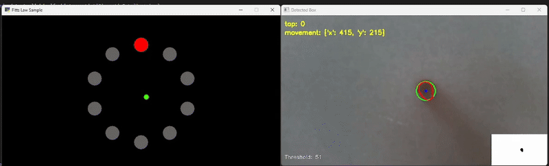
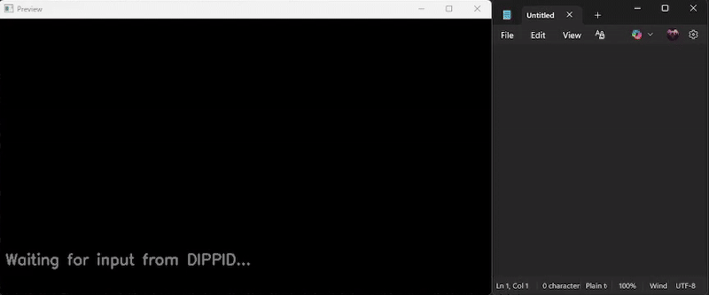

[](https://classroom.github.com/a/BegzSP5S)

# Setup

1. Clone the repo
2. `cd` into the repo directory
3. Setup and activate a virtual env **(Python 3.12)**
4. `pip install -r requirements.txt`

Both applications can be closed with `Ctrl+C` in the terminal or with `Q` / `ESC` when the preview window is focused.  

# Camera-Based Touch Sensor

Documentation on this task can be found in [documentation.md](documentation.md).  



**How to launch the application:**

```bash
# Complete the setup steps above
python touch_input.py -c 0 -d

# OR launch the app in the background with the fitts_law application
python touch_input.py -c 0 &
python fitts_law.py 10 20 140 0
```

## Command Line Parameters

> ⚠️ Make sure to choose the correct webcam ID (likely not 0)!

| Parameter | Short Option | Default | Description |
|-----------|--------------|---------|-------------|
| `--video-id` | `-c` | `0` | ID of the webcam you want to use |
| `--debug` | `-d` | `False` | Enable debug mode (Whether to show preview window or not) |
| `--host` | | `127.0.0.1` | Host to broadcast events to (DIPPID) |
| `--port` | `-p` | `5700` | Port to broadcast events to (DIPPID) |
| `--calibration-frames` | | `5` | Number of frames to use for brightness calibration |

# Touch-based Text Input

Documentation on this task can be found in [documentation.md](documentation.md).  



**How to launch the application:**
```bash
# Complete the setup steps above
# Launch the touch_input application in parallel with the text_input application
python touch_input.py -c 0 &
python text_input.py -t 1.5 -d
```

> ⚠️ Using the command above launches the `touch_input` application in the background without a preview window and only shows the `text_input` preview window.

## Command Line Parameters

| Parameter | Short Option | Default | Description |
|-----------|--------------|---------|-------------|
| `--port` | `-p` | `5700` | Port to broadcast events to (DIPPID) |
| `--confidence-threshold` | | `0.9` | Minimum confidence threshold for auto-typing, if it is below the threshold the character will not be typed by pynput |
| `--debug` | `-d` | `False` | Enable debug mode (Whether to show preview window or not) |
| `--detection-timer` | `-t` | `1.5` | The amount of time in seconds to wait after the last input before making a prediction (seconds) |