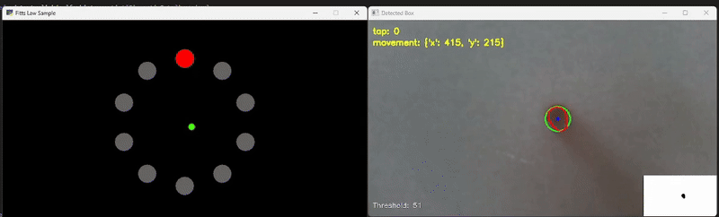

# Camera-Based Touch Sensor

Instructions on how to launch and configure the application are located in [README.md](README.md).  

---

## 1. Design Decisions

### 1.1 "Hardware"

Since the FoV of the camera was unable to capture the entire surface of the plexiglass, I decided to draw a rectangle on a sheet of paper doubling as a diffuser.
This also makes it a lot easier to assemble the setup since you only have to put the camera in the box and can then place the plexiglass with the paper on top of it and align the rectangle with the camera view when launching the program.  
**The physical rectangle is not used for any detection or calibration steps, it is purely for visual reference for the user!**

### 1.2 Calibration

For the calibration step at the start I decided to wait for a few frames before capturing the average brightness because the first few frames somehow started extremely dark consistently. After these frames are skipped the app takes the average brightness of a few frames and maps this brightness to a value between 30 and 70 (arbitrary based on different lighting conditions I tested in) to be used as a threshold for the binary thresholding applied in later steps.

> ⚠️ My room is not very bright so there might be a slight bias towards darker conditions. If the input doesn't work as expected you could try low to medium lighting conditions since very bright conditions have not been accounted for or tested.

### 1.3 Image Preprocessing and Fingertip Detection

After playing around with a few basic preprocessing techniques like blurring, contrast enhancement and thresholding, I found that finding contours was still pretty rough and I often had issues with the palm or finger shadows being picked up. Despite that the image is still preprocessed with a Gaussian blur to reduce noise and a grayscale conversion to simplify the image.

> ⚠️ Shadows should not be picked up and interfere with the detection but it is still advisable to be in an environment that does not cast prominent shadows on the touch area.

#### 1.3.1 CLAHE

As a solution to this I found CLAHE (Contrast Limited Adaptive Histogram Equalization) to be very effective. It enhances the contrast of the image in a way that is adaptive to local regions, which helps in distinguishing the fingertips from the background and shadows. In combination with closing and opening the image to remove speckles and merge areas with holes I was then able to cleanly seperate all contours based on their size and only pass the ones that are likely to be fingertips.

#### 1.3.2 History

On top of that I implemented a _history_ system that keeps track of a fingertip based on position delta. This way I could filter out any noise that might occur if a fraction of the palm or a shadow was picked up as a fingertip for a few frames.

#### 1.3.3 Circularity Score

To further improve the classification of fingertips I used the enclosing circle of the contour (after slightly smoothing the countour) to check the circularity of the contour. The circularity describes how close the contour is to a perfect circle. For one this helped me filter out contours that are not fingertips but it also gave me a score that I could use to determine if a finger is pressed down or not since the fingertip has a rather round shape compared to the oval shape when pressing a little harder. 

**There is also a leftover solidity check that I used before adding polymorphic operations to close gaps. I never removed it but I don't think it really does anything useful anymore since the solidity is always extremely high even for the palm. The contour area threshold is what handles most of the filtering.**

### 1.4 Event Detection

For movement events I simply used the center of the enclosing circle described above. I didn't feel the need to apply any smoothing to the history of the fingertip since it is supposed to work 1:1 in real-time and the jitter was not bad at all. For tap detection I tried to detect patterns in the history of a fingertip, e.g. a pattern of `high circularity -> low circularity -> high circularity` matched with a pattern of `low radius -> high radius -> low radius` would indicate a tap. However, this was not very reliable and resulted in a lot of false positives. Instead I decided to implement a simple cooldown for taps and check if the average radius and circularity of the last few history entries matched certain thresholds. Low circularity and high radius indicates a tap so the system continously registers taps (with a cooldown) as long as a finger is pressed down.

### 1.5 Data Broadcasting

The data is broadcasted using `DIPPID` with the required structure and works fine in combination with [fitts_law.py](fitts_law.py).
The y coordinates are manually flipped before broadcasting to match the pyglet coordinate system.  
The events that are broadcasted are also printed on the preview window.

### 1.6 Aspect Ratio

I found that a 16:9 aspect ratio makes the most sense since ultimately this app is supposed to map the movement of the finger 1:1 to a screen and most screens are 16:9 and the camera is as well. In order to properly match up the coordinates I had to slightly modify the code in [fitts_law.py](fitts_law.py) to match the camera's aspect ratio.

## 2. Building Process

    

        
        
<em>Box Exterior</em>

    

    

        
        
<em>Box Interior</em>

    

I closed the box on the bottom to provide a stable base for the camera. For consistency when reassembling I marked the position and rotation of the camera on the inside of the box. The cable was simply routed through one of the 4 corners but doesn't matter as long as the camera is in the designated position. I flipped the cardboard that makes up the top of the box to the inside to provide more stability. The plexiglass was then put on top with a sheet of paper taped to it to act as a diffuser. As described in the first section I then drew a rectangle on the paper to indicate the touch area that the camera is able to physically see. During development I also taped down the camera however this is not necessary as long as nobody yanks on the cable.

**Note: Initially I folded the top "flaps" of the box upwards so that the camera's FoV would be able to capture the entire surface but decided against it because the entire thing was unstable and not really practical/convenient to use. In my opinion drawing the visible area on the paper is a lot more practical and easier to assemble.**

## 3. Usage Guide

Instructions on how to launch and configure the application are located in [README.md](README.md).

Assemble the box so that all marked areas inside the box line up. Put the camera at the designated spot and route the cable through one of the corners. Put the plexiglass on top of the box with the paper taped to it and align the rectangle with the camera view. Launch the application and let it calibrate (If fingertip detection does not work as seen in the example gif, adjust the lighting or trick the app by putting your hand on the touch area during calibration to achieve different thresholds).

Once the app is launched and calibrated you will see the preview window. Put a fingertip on the touch area and it should show the detected contour, enclosing circle and center point around your fingertip. A small debug view in the bottom right also shows the preprocessed image at the step before searching for contours.
Move your finger

## 4. Limitations

Despite the calibration, the camera seems to not pick pick up the hard shadow of the fingertip against the soft shadow of the finger at the edges of the touch area. This is apparent when simply looking at the webcam image without any processing. This results in taps not being registered correctly sometimes at the very edges of the touch area.
This is a hardware limitation I was not able to fix with my setup but I assume it would have worked better with a taller box or if making the touch area even smaller but neither of these options were a practical solution to me. The best solution would be to use a camera with a wider FoV to allow for larger touch area without having to make the box taller, less stable and less practical to use.

# Touch-based Text Input

Instructions on how to launch and configure the application are located in [README.md](README.md).

---

I decided to implement this application in a similar way to the [fitts_law.py](fitts_law.py) application using DIPPID as a protocol to read the input events. This way the text input is entirely separate and independent of the touch sensor application itself.

## 1. Dataset

I used the [Extended MNIST](https://www.tensorflow.org/datasets/catalog/emnist#emnistbyclass_default_config) dataset for training the model. It is contained in the [tdfs](https://www.tensorflow.org/datasets/api_docs/python/tfds) library and automatically downloaded on the first launch of the application. To reduce training time I only used a subset of the dataset and in order for the classification to be more accurate I extracted only **lowercase letters** from the dataset. The data is conventionally split into a training and test set. The images are transformed to be up right like the input data.  

## 2. Model

I chose between the [$N Recognizer](https://depts.washington.edu/acelab/proj/dollar/ndollar.html), OCR (Tesseract) and a CNN. I couldn't find a good $N python implementation to use and OCR was not very reliable so I went with a CNN. The model uses 2 convolutional layers and 2 dense layers and is stored in [text_input.keras](text_input.keras) for convenience. If you want to retrain the model simply delete the file and run the application again, it will automatically download the dataset and train the model. The training process takes around 15 minutes on decent hardware. 

## 3. Application

The application spawns a DIPPID listener and waits for any `movement` events. When it receives an event, a timer starts (see [README.md](README.md)) and the application begins to collect touch points. The timer is extended with each new event, and when it expires, the application makes a prediction based on the collected points.
When the `--debug` flag is active, the application shows a preview window visualizing the input data and the prediction. The application also prints the prediction to the console and types it using `pynput` if the confidence is above a certain threshold (see [README.md](README.md)). The window will not show any text indicating this however the border of the rasterization preview will be green if the letter is typed and red if it's not. The application also prints the prediction and key press events in the console.

## 4. Limitations

The app does not support digits or uppercase letters. However the training data for them is already available and it would probably work fine with some adjustments. However I didn't really see the need for this as it would be better, in my opinion, to e.g. designate modifier areas on the touch area instead like shift in the bottom left corner or something which could also be pressed by pynput. Most text input applications have auto capitalization anyway and considering the scope of this task I found it more than sufficient to only support lowercase letters.

Full word input is not possible either since by design only single letters can be recognized. For full word recognition OCR would probably be more suitable but single letter input provides the most flexibility.